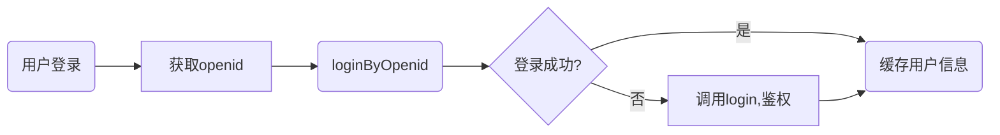

## user相关接口   
* [x] <a href='#login'>login</a>   
* [x] <a href='#getOpenid'>getOpenid</a>   
* [x] <a href='#loginByOpenid'>loginByOpenid</a>   
* [x] <a href='#logout'>logout</a>   
* [x] <a href='#get'>get</a>   
* [x] <a href='#update'>update</a>    


## 接口文档   
domain=‘http(s)://lostandfoundv2.yiwangchunyu.wang’

微信小程序登陆流程   
[](https://mermaid-js.github.io/mermaid-live-editor/#/edit/eyJjb2RlIjoiZ3JhcGggTFJcbiAgICBIKHVzZXIgbG9naW4pIC0tPiBBW2dldCBvcGVuaWRdXG5cdEEgLS0-IEIoY2FsbCBsb2dpbkJ5T3BlbmlkKVxuICAgIEIgLS0-IEN7bG9naW4gc3VjY2VkZWQ_fVxuICAgIEMgLS0-fHllc3wgRChjYWNoZSB1c2VyIGluZm8pXG4gICAgQyAtLT58bm98IEVbY2FsbCBsb2dpbiBieSBzdHVkZW50IE5vLiBhbmQgcHdkXVxuICAgIEUgLS0-RCIsIm1lcm1haWQiOnsidGhlbWUiOiJkZWZhdWx0In0sInVwZGF0ZUVkaXRvciI6ZmFsc2V9)



请注意！：用户在服务端的唯一标识为user_id，不是opendi or stu_id
### <a name='login'>login</a> 用户登录（无状态登录）
url = {domain}/service/user/login   
method = post   
params:   

|   名称  | 类型 | 必须 | 备注 |
| :-----| ----: | :----: | :----: |
|openid | string | Y | 可通过getOpenid获取，获取后清缓存到前端当做tocken |
|stu_id | string| Y | 学工号 |
|password | string| Y | 学工号密码 |
|gender | int| Y | 有1说1，没1说0 |
|phone | string| Y | 手机号，前端请在验证码验证后调此接口 |
|avatar | string| Y | 头像url（微信头像） |

return:
```json
{
    "code": 0,
    "msg": "success",
    "data": {
        "id": 1,
        "status": 1,
        "ctime": "2020-03-20 08:53:49",
        "mtime": "2020-03-20 10:49:53",
        "stu_id": "10152150127",
        "nick_name": "yiwangchunyu",
        "name": "汪春雨",
        "avatar": "http://127.0.0.1:8000/media/avatar/1_20200320184953.jpg",
        "gender": "1",
        "phone": "18918053907",
        "role": 2
    }
}
```

### <a name='getOpenid'>getOpenid</a> 获取用户openid   
url = {domain}/service/user/getOpenid   
method = post   
params:   

|   名称  | 类型 | 必须 | 备注 |
| :-----| ----: | :----: | :----: |
|js_code | string | Y |  |

return:
```json

```

微信更新后使用如下方法：   
https://developers.weixin.qq.com/miniprogram/dev/wxcloud/guide/functions/userinfo.html

### <a name='loginByOpenid'>loginByOpenid</a> 通过openid登陆，获取个人信息，以及user_id   
url = {domain}/service/user/loginByOpenid   
method = post   
params:   

|   名称  | 类型 | 必须 | 备注 |
| :-----| ----: | :----: | :----: |
|openid | string | Y |  |

return:
```json
{
    "code": 0,
    "msg": "success",
    "data": {
        "id": 1,
        "status": 1,
        "ctime": "2020-03-20 08:53:49",
        "mtime": "2020-03-20 10:49:53",
        "stu_id": "10152150127",
        "nick_name": "yiwangchunyu",
        "name": "汪春雨",
        "avatar": "http://127.0.0.1:8000/media/avatar/1_20200320184953.jpg",
        "gender": 1,
        "phone": "18918053907",
        "role": 2
    }
}
```

### <a name='logout'>logout</a> 用户登出   
url = {domain}/service/user/logout   
method = post   
params:   

|   名称  | 类型 | 必须 | 备注 |
| :-----| ----: | :----: | :----: |
|user_id | int | Y |  |

return:
```json
{
    "code": 0,
    "msg": "success",
    "data": []
}
```

### <a name='get'>get</a> 获取用户详情   
url = {domain}/service/user/get   
method = post   
params:   

|   名称  | 类型 | 必须 | 备注 |
| :-----| ----: | :----: | :----: |
|user_id | int | Y |  |

return:
```json
{
    "code": 0,
    "msg": "success",
    "data": {
        "id": 1,
        "status": 1,
        "ctime": "2020-03-20 08:53:49",
        "mtime": "2020-03-20 10:49:53",
        "stu_id": "10152150127",
        "nick_name": "yiwangchunyu",
        "name": "汪春雨",
        "avatar": "http://127.0.0.1:8000/media/avatar/1_20200320184953.jpg",
        "gender": 1,
        "phone": "18918053907",
        "role": 2
    }
}
```

### <a name='update'>update</a> 更新用户信息   
url = {domain}/service/user/update   
method = post   
params:   

|   名称  | 类型 | 必须 | 备注 |
| :-----| ----: | :----: | :----: |
|user_id | int | Y |  |
|update | json | Y |  |

e.g.:   
update={"phone":"18918053907"}   

return:   
```json
{
    "code": 0,
    "msg": "success",
    "data": []
}
```